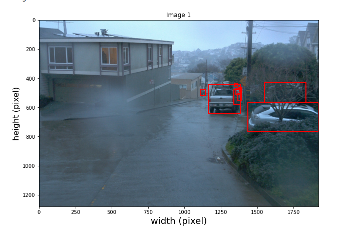
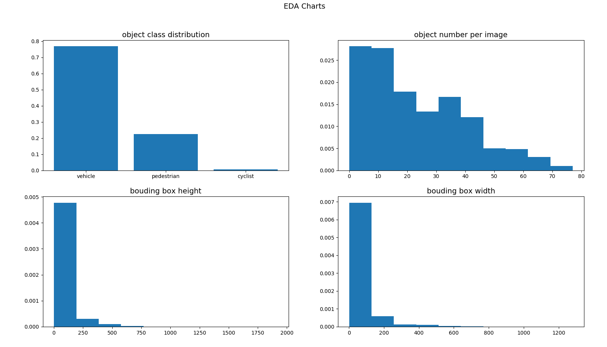
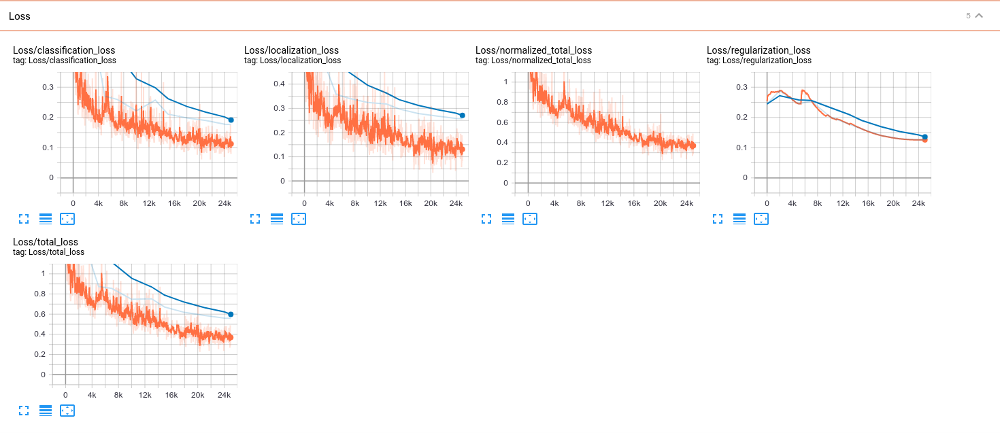
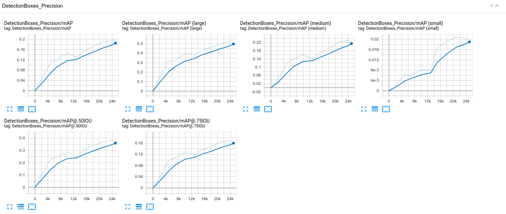
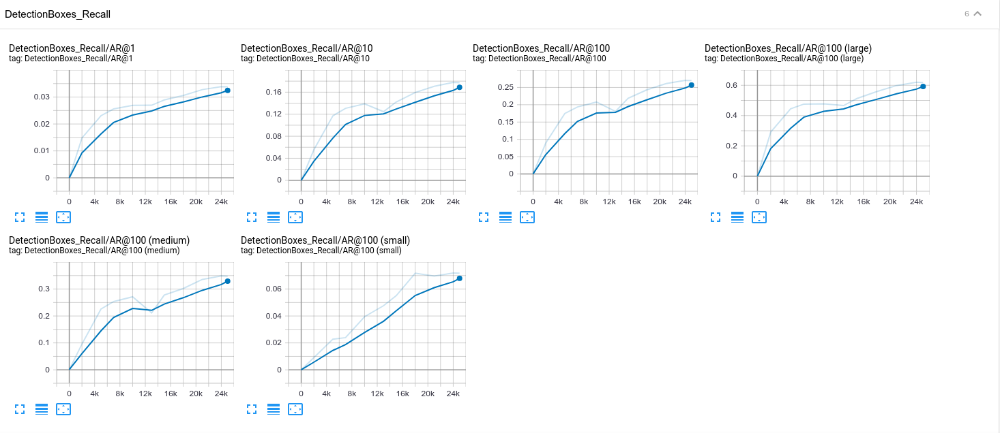
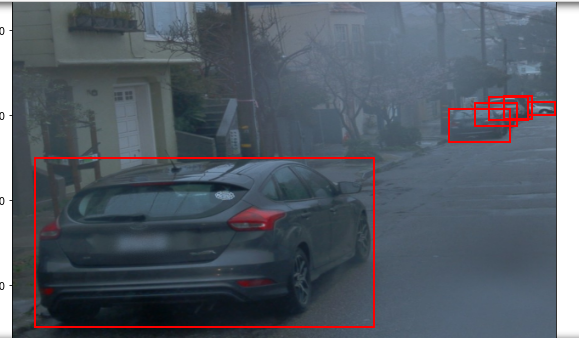
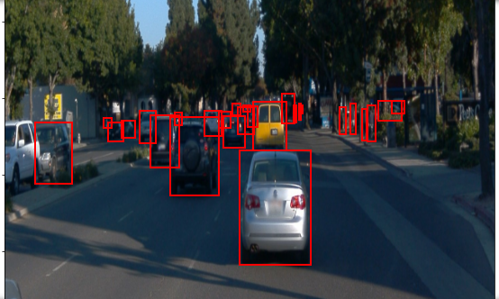
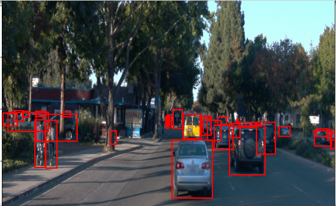
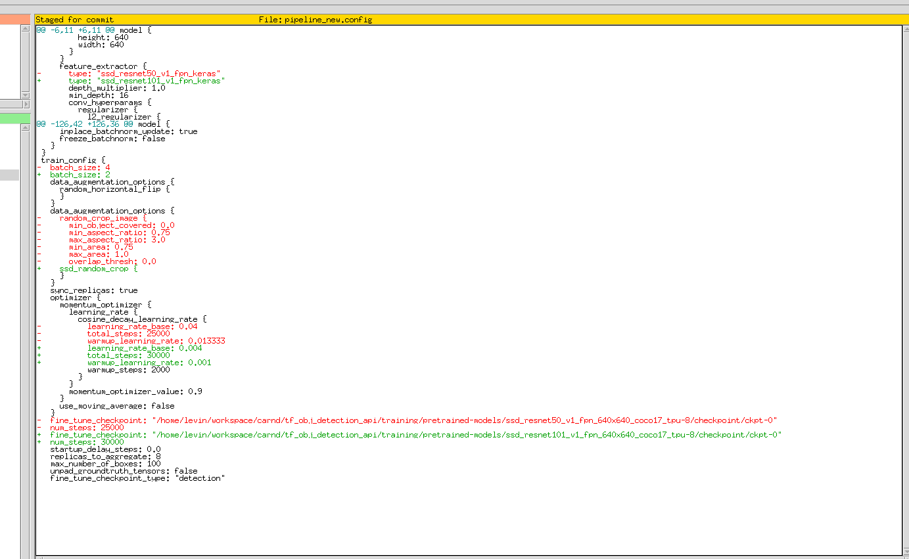
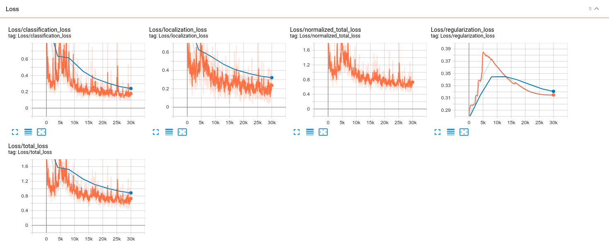

# Object detection in an Urban Environment

## Project overview

In this project, we take advantage of tensorflow object detection API to train a custom object detector. All the training and validation data will be from the [Waymo Open dataset](https://waymo.com/open/). We will walk through the complete pipeline of model training, including dataset analysis, data split, model training, model improvement, and model export. At the end, we will create  a short video of our model predictions to showcase the result.

The project resides in github, and the link is [here](https://github.com/LevinJ/tf_obj_detection_api)


## Source code structure

The files in this project are organized as follows:

Video folder stores resultant prediction videos for both reference model and improved model.

Script files under direct project folder:

* download_process.py: download [Waymo Open dataset](https://waymo.com/open/) from [Google Cloud Bucket](https://console.cloud.google.com/storage/browser/waymo_open_dataset_v_1_2_0_individual_files/)
* eda.py: transverse the dataset and draw EDA charts
* create_splits.py: create the train/eval/test data split
* edit_config.py: generate model training configuration files
* Exploratory Data Analysis.ipynb: visualize image and ground truth annotations, and help with dataset analysis
* Explore augmentations.ipynb: explore different augmentation methods
* filenames.txt: list tf record files to be downloaded
* inference_video.py: create animation video

For all of the above python scripts, we've modified the parameters parsing section so that the scripts can run well with default values. This means we don't have to append parameters when running the scipts. For example, to download the dataset, just go to the project folder, and then run below command,

```
python download_process.py
``` 

experiments folder store train/eval script and the export script:    
* exporter_main_v2.py: train or evaluate the model, depending on input parameters     
* exporter_main_v2.py: convert the trained model to more compact inference model     

data folder stores images and annotatons    
* processed: contained the tf records in the Tf Object detection api format. (NOTE: this folder should be empty after creating the splits)    
* test: contain the test data    
* train: contain the train data   
* val: contain the val data     

## Installation

To run the codes developed in this project, tensorflow object detection API is required. Please see the README file in the build folder for how to set up the environment.

## Dataset

### Data download

The first goal of this project is to download the data from the Waymo's Google Cloud bucket to local machine. For this project, we only need a subset of the data provided (for example, we do not need to use the Lidar data). Therefore, we are going to download and trim immediately each file. 

`create_tf_example` function takes the components of a Waymo Tf record and save them in the Tf Object Detection api format. Its implementation is as below,

```
def create_tf_example(filename, encoded_jpeg, annotations):
    """
    This function create a tf.train.Example from the Waymo frame.

    args:
        - filename [str]: name of the image
        - encoded_jpeg [bytes]: jpeg encoded image
        - annotations [protobuf object]: bboxes and classes

    returns:
        - tf_example [tf.Train.Example]: tf example in the objection detection api format.
    """

    encoded_jpg_io = io.BytesIO(encoded_jpeg)
    image = Image.open(encoded_jpg_io)
    width, height = image.size
    
    image_format = b'jpeg'
    
    xmins = []
    xmaxs = []
    ymins = []
    ymaxs = []
    classes_text = []
    classes = []
    
    for index, row in enumerate(annotations):
        
        xmin = row.box.center_x - row.box.length/2.0
        xmax = row.box.center_x + row.box.length/2.0
        ymin = row.box.center_y - row.box.width/2.0
        ymax = row.box.center_y + row.box.width/2.0
        
         
        xmins.append(xmin / width)
        xmaxs.append(xmax / width)
        ymins.append(ymin / height)
        ymaxs.append(ymax / height)
        classes_text.append(class_text_to_int(row.type).encode('utf8'))
        classes.append(row.type)

    filename = filename.encode('utf8')
    tf_example = tf.train.Example(features=tf.train.Features(feature={
        'image/height': int64_feature(height),
        'image/width': int64_feature(width),
        'image/filename': bytes_feature(filename),
        'image/source_id': bytes_feature(filename),
        'image/encoded': bytes_feature(encoded_jpeg),
        'image/format': bytes_feature(image_format),
        'image/object/bbox/xmin': float_list_feature(xmins),
        'image/object/bbox/xmax': float_list_feature(xmaxs),
        'image/object/bbox/ymin': float_list_feature(ymins),
        'image/object/bbox/ymax': float_list_feature(ymaxs),
        'image/object/class/text': bytes_list_feature(classes_text),
        'image/object/class/label': int64_list_feature(classes),
    }))
    return tf_example
```


### Dataset analysis

In `Exploratory Data Analysis` notebook, we display images and corresponding annotations in the Waymo dataset.  When plotting bounding boxes, different classes are color coded, like below



You can also run the notebook to see more similar image display.

The codes for displaying images are as below,

```
#draw groud truth bounding boxes on an image
def draw_detections(img, boxes, classes, i):
    f, ax = plt.subplots(1, figsize=(10, 10))
    ax.imshow(img.astype(np.uint8))
    #color for each categroy
    color_dict = {1: 'r', 2: 'b', 4:'g'}
    for box,box_class in zip(boxes, classes):
        y1, x1, y2, x2  = box
        rec = Rectangle((x1, y1), x2-x1, y2-y1, facecolor='none', edgecolor=color_dict[box_class], linewidth=2)
        ax.add_patch(rec)
    plt.title(f'Image {i}')
    plt.xlabel('width (pixel)', fontsize=18)
    plt.ylabel('height (pixel)', fontsize=16)
    plt.show()
    return

i = 1
def display_instances(batch):
    """
    This function takes a batch from the dataset and display the image with 
    the associated bounding boxes.
    """
    # ADD CODE HERE
    global i
    plt.figure()
    img  = batch['image'].numpy()
    h, w, _c = img.shape 
    boxes = batch['groundtruth_boxes'].numpy()
    boxes[:,(0,2)] *= h
    boxes[:,(1,3)] *= w
    classes = batch['groundtruth_classes'].numpy()
    draw_detections(img.copy(), boxes, classes, i)
    i = i+ 1
    return
```

After displaying random images from several tf record files, we can observe:

1) All the images are recorded in urban environment.   
2) Object classes include vehicle,pedestrian, and cyclist. 

We also wrote a small python script "eda.py" to gain more understanding about the dataset.



We can observe a few interesing points from the above charts.

* The number of vehicle objects in images are much larger than the other two.   
* For some of the images, the number of labelled objects are quite large (more than 30)  
* Some of the labelled objects are outside of image boundary (bounding box height is larger than image height)  
 

### Data splits

In `create_splits.py` script, dataset are split into train, and eval, and test, whose ratios are set as 0.8, 0.1, 0.1 respectively.

Specifically speaking, below is the data splitting steps:

1) Shuffle the whole dataset   
The intent behind this step is to make sure that the three splits we obtain later on have similar scenarios, for example, they all have urban and highway scenario. The validation performance of the trained model is expected to be poor if the trainig and validation scenarios are very different.   
2) Split the dataset into train, eval and test    
The train split is used to train the model, the eval split helps us decide when to stop the training, as we want the model to fit the training data well but we also don't want it to overfit. The test split is used to test the model's accuracy.   
3) Make sure train/eval/test splits have appropirate ratios.   
With insufficent training data, the model is likely to overfit; on the other side, with insufficent eval/test data, we may not be able to get an accurate estimate of the model's accuracy due to lack of test samples. As a result, we need to strike a right balance with respect to  ratio split. The ratios used in splitting dataset is mainly based on past experience. In this project, we adopted a commonly occurring ratio in machine learning community, the ratio we used for train/eval/test is 0.8, 0.1, 0.1.  


Codes for data split are mainly done in below function,

```
def split(data_dir):
    """
    Create three splits from the processed records. The files should be moved to new folders in the 
    same directory. This folder should be named train, val and test.

    args:
        - data_dir [str]: data directory, /mnt/data
    """
    training_files = glob.glob(data_dir + '/processed/*.tfrecord')
    shuffle(training_files)
    num = len(training_files)
    
    # create the directry
    for _dir in ["train", "eval", "test"]:
        dir_path = "{}/{}".format(data_dir, _dir)
        dir_path = os.path.abspath(dir_path)
        os.makedirs(dir_path, exist_ok=True)
    
    #split out the training part, 0.8
    start = 0
    end = start + int(0.8 * num)
    for file_path in training_files[start:end]:
        dst_path = "{}/train/{}".format(data_dir, os.path.basename(file_path))
        shutil.move(file_path, dst_path)
    #split out the eval part, 0.1
    start = end
    end = start + int(0.1 * num)
    for file_path in training_files[start:end]:
        dst_path = "{}/eval/{}".format(data_dir, os.path.basename(file_path))
        shutil.move(file_path, dst_path)
    
    #split out the test part, 0.1
    for file_path in training_files[end:]:
        dst_path = "{}/test/{}".format(data_dir, os.path.basename(file_path))
        shutil.move(file_path, dst_path)
    return
```

## Training 
### Reference experiment

With the reference configuration provided in project starter code, we trained and evaluated the model. Below are the steps to follow:

1) To train the model, run `python experiments/model_main_tf2.py --model_dir=training/reference/ --pipeline_config_path=training/reference/pipeline_new.config` in the terminal.   
2) To evaluate the model while it's being trained, run `CUDA_VISIBLE_DEVICES=""  python  ./experiments/model_main_tf2.py --model_dir=training/reference/ --pipeline_config_path=training/reference/pipeline_new.config --checkpoint_dir=training/reference/`   
3) To monitor the training progress, run `tensorboard --logdir="training/reference`   


Tensorboard is a great tool that can help us monitor and analyze the training pocess. We'll look into a few major charts provided in tensorboard.

1) Loss charts


The Loss charts show the loss changes during the training process, on both training dataset and evaluation dataset. From the chart, we can see that both training loss and evaluation loss keep descreasing as the training goes on, and evaluation loss is slightly higher than trinig loss, which is what we expect. 

Also the loss curve does not really plateau near the end, indicating that we could probably get better model accuracy by training a bit longer.




2) Precision charts

Precision charts show the precision change on evalation dataset. From the chart, we can see that our model does a better job on larger object detection.



3) Recall charts

Apart from precision, the other metrics of model evaluation is recall rate. The charts are as below,




After the model training completes, we can export the trained model to get a more compact inference model. Exporting model can be achieved by `python experiments/exporter_main_v2.py`. 

Finally we generate the animation video on model prediction by `python inference_video.py`. The resultant video is under `video` folder, The video file name is `animation_reference.mp4`


### Improve on the reference

Based on the reference configuration, five new training strategies are explored in an attempt to further improve the model.

1) augmentation method

Per [SSD paper](https://arxiv.org/pdf/1512.02325.pdf), appropriate data augmentation can dramatically improve model accuracy. Reference configuration performs random horizontal flip and typical random crop. Here we decide to try the ssd_random_crop data augmentation, the image cropping method used in SSD original paper.

More implementation details about ssd_random_crop data augmentation can be found in [preprocessor.proto](https://github.com/tensorflow/models/blob/master/research/object_detection/protos/preprocessor.proto)

With the `Explore augmentations.ipynb`notebook, we can visualize the image augmentation result.









2) backbone network
Reference configuration's backbone network is resnet50. On the other side, one easy way to improve model accuray is to use deeper networks, so here we would replace resnet50 by the ResNet101 

The pretrained model can be downloaded from [Tf Object Detection API model zoo](https://github.com/tensorflow/models/blob/master/research/object_detection/g3doc/tf2_detection_zoo.md)

3) learning rate

With the newly introduced backbone network resnet101, we find that the training quickly diverge right after it starts. So learning rate is lowered to avoid this probem.

4) batch size

It turns out that training resnet101 requires more GPU memtory than my GPU can afford (out of memory error), so we reduce the batch size from 4 to 2.

5) training iterations

The new data augmentation adds more image variability, and the new backbone network has more model parameters, to make sure the model are sufficiently trained, we extend the training iterations from 25000 steps to 30000 steps.


Below image summarizes configuration changes mentioned above



With tensorboard, we can see the loss charts. 




The resultant video is under `video` folder, and the video file name is `animation_improved.mp4`
 

## Reflection

This is definitely a fun project, the most interesing part (and time consuming as well) is to fine tune the model and relevant training parameters. Going forward, I think below aspects of the project are worth further exploring:

1) Optimizer

From the loss charts, we can observe that the loss are relatively high, and does not pleatau near the end. we could have the model better trained by trying below methods,

* different optimizer, like Adam
* increase training iterations
* different learning rate

2) Lightweight models

It could be fun to try with more lightweight models like mobilenet so that we can run predictions on mobiles.

3) Training time

Currently training takes quite some time, about 6 hours on my GeForce GTX 1080. As we start from pre-trained COCO weights, the early layers are already trained to extract low-level features and we can benefit from that, especially when Waymo images are also natural images like the ones in COCO. Consequently, we can try training only a subset of layers (like the head layers), as opposed to all alyers, which is expected to quicken the training process.


 
